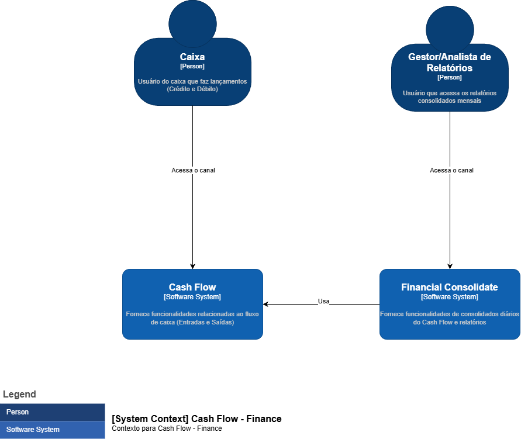
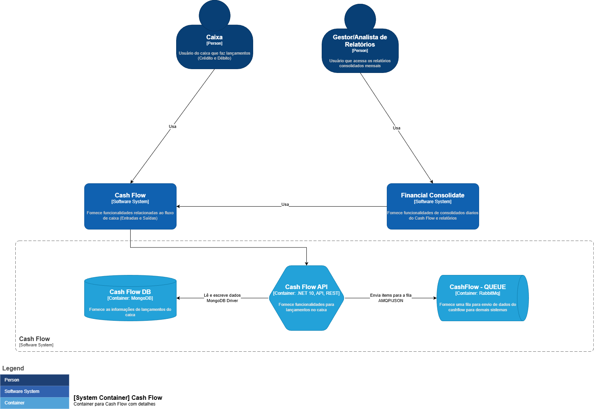
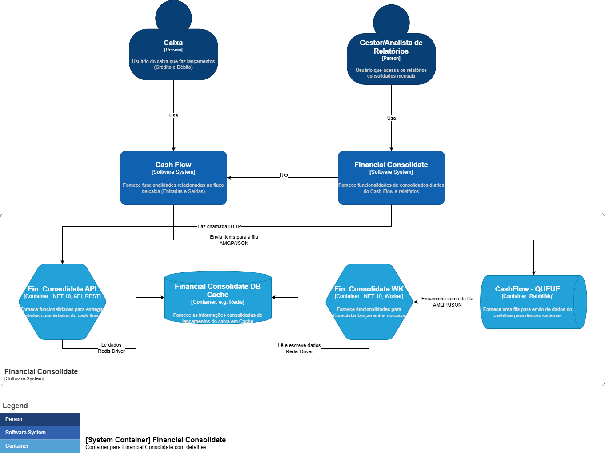

# Documento de Arquitetura de Solução  
**Controle de Fluxo de Caixa e Consolidação de Dados**

---

## Informações do Documento

| Campo | Valor |
|------|-------|
| Arquiteto Responsável | Fernando Florencio de Oliveira |
| Data | 01/2026 |
| Versão | 1.0 |
| Status | Em elaboração |

---

## Histórico de Versões

| Versão | Data | Autor | Descrição |
|------|------|------|-----------|
| 1.0 | 01/2026 | Fernando Florencio de Oliveira | Versão inicial do documento |

---

## 1. Introdução

### 1.1 Contexto

Este documento descreve a arquitetura da solução proposta para controle de fluxo de caixa diário e consolidação de dados financeiros, atendendo às necessidades operacionais e gerenciais de comerciantes.

### 1.2 Objetivo do Documento

O objetivo deste documento é apresentar:
- A visão geral da solução
- As capacidades de negócio envolvidas
- Os requisitos funcionais e não funcionais
- As diretrizes arquiteturais adotadas

Este documento serve como referência para equipes técnicas, arquitetos, stakeholders de negócio e times de operação.

---

## 2. Visão Geral da Solução

A solução tem como finalidade permitir que um comerciante realize o controle diário de entradas e saídas financeiras, bem como a geração de relatórios consolidados de saldo diário, garantindo escalabilidade, resiliência e disponibilidade.

---

## 3. Capacidades de Negócio

### 3.1 Cash Flow

Capacidade responsável pelo registro e manutenção dos lançamentos financeiros, contemplando:
- Débitos
- Créditos
- Persistência dos dados de caixa

### 3.2 Finance Consolidate

Capacidade responsável por:
- Consolidação diária das operações de caixa
- Cálculo de saldo diário
- Geração de relatórios financeiros para consumo gerencial

---

## 4. Arquitetura da Solução

### 4.1 Visão Arquitetural

A solução será composta por serviços independentes, permitindo desacoplamento entre as operações de lançamento financeiro e o processo de consolidação diária, garantindo maior resiliência e escalabilidade.

Você pode acessar todos os diagramas pela plataforma do Draw IO pelo [LINK](https://drive.google.com/file/d/13uJC5h6orcYGYhFBDFSJuhOsAosX8uQT/view?usp=sharing) ou conferir abaixo cada um deles nas imagens

### 4.1.1 Diagrama de Contexto (C4 – Context)

### 4.2.1 Diagrama de Container - CashFlow (C4 – Container)

### 4.2.2 Diagrama de Container - Consolidated (C4 – Container)

### 4.3.1 Diagrama de Topologia (Arq. Alvo)

---

## 5. Requisitos

### 5.1 Requisitos de Negócio

| ID | Descrição |
|----|-----------|
| RN-01 | O comerciante deve controlar o fluxo de caixa diário por meio de lançamentos de débitos e créditos. |
| RN-02 | O sistema deve disponibilizar um relatório com o saldo diário consolidado. |

### 5.2 Requisitos Funcionais

| ID | Descrição |
|----|-----------|
| RF-01 | O sistema deve disponibilizar um serviço para registro de lançamentos financeiros (débitos e créditos). |
| RF-02 | O sistema deve disponibilizar um serviço responsável pela consolidação diária do fluxo de caixa. |

### 5.3 Requisitos Não Funcionais

| ID | Descrição |
|----|-----------|
| RNF-01 | O serviço de lançamentos não deve ficar indisponível caso o serviço de consolidação diária apresente falhas. |
| RNF-02 | O serviço de consolidação diária deve suportar picos de até **50 requisições por segundo**. |
| RNF-03 | A taxa máxima de perda de requisições durante picos deve ser de **5%**. |
| RNF-04 | A solução deve ser escalável, suportando dimensionamento horizontal e balanceamento de carga. |

---

## 6. Decisões de Arquitetura (ADR)

### ADR 001: Escolha do Redis como Banco de Dados em Cache para as Consultas do Consolidado

#### Status
Aceito

### Data
01/2026

---

### Contexto

Durante o desenho da arquitetura do projeto **CashFlow**, foram definidos requisitos não funcionais relacionados a desempenho e resiliência do serviço responsável pela consolidação diária de dados financeiros. Em especial, destacam-se os seguintes requisitos:

| Código  | Descrição                                                                 |
|--------|---------------------------------------------------------------------------|
| RNF-02 | O serviço de consolidação diária deve suportar picos de até **50 requisições por segundo** |
| RNF-03 | A taxa máxima de perda de requisições durante picos deve ser de **5%**     |

O sistema CashFlow adota uma arquitetura baseada em **microserviços**, sendo que o **serviço de consolidados** é responsável por expor consultas frequentes a dados já processados e agregados.

Para atender a esses requisitos não funcionais, identificou-se a necessidade de introduzir um mecanismo de **cache em memória**, capaz de reduzir a carga sobre os bancos de dados primários e garantir tempos de resposta consistentes sob alta concorrência.

---

### Requisitos Técnicos

Os requisitos técnicos considerados para a solução de cache foram:

- **Baixa latência** como requisito crítico, devido aos limites impostos pelos RNFs.
- **Alta capacidade de concorrência**, suportando múltiplas requisições simultâneas.
- **Escalabilidade horizontal**, permitindo crescimento do sistema sem degradação significativa de performance.
- **Persistência dos dados em cache sem expiração automática**, uma vez que os consolidados diários devem permanecer disponíveis para consulta contínua.
- **Modelo simples de dados**, baseado em chave e valor, sem necessidade de estruturas complexas.

---

### Alternativas Avaliadas

As seguintes alternativas foram consideradas antes da decisão final:

#### Banco de Dados Relacional
Embora bancos relacionais sejam adequados para persistência e consistência transacional, eles não são otimizados para cenários de leitura intensiva com baixa latência e alta concorrência. O uso do banco relacional como mecanismo de cache implicaria maior sobrecarga de I/O, locks e competição por recursos, podendo comprometer o atendimento aos requisitos de desempenho, além do alto custo para uma estrutura muito simples de registros e consultas.

#### MongoDB
O MongoDB oferece flexibilidade de esquema e boa performance em determinados cenários, porém continua sendo um banco orientado a persistência em disco. Mesmo com índices, o custo de acesso e a latência são superiores quando comparados a soluções de cache em memória, especialmente sob cargas elevadas e padrões de acesso repetitivos.

Ambas as alternativas não atendiam de forma ideal aos requisitos de latência e throughput exigidos pelo serviço de consolidados.

---

### Decisão

Foi decidido utilizar o **Redis** como banco de dados em cache para as consultas do consolidado diário.

O Redis foi escolhido por ser uma solução de cache em memória amplamente adotada, com excelente desempenho para operações de leitura, suporte nativo a alta concorrência e capacidade de escalar horizontalmente. Sua arquitetura é especialmente adequada para cenários de acesso frequente a dados já processados, como é o caso dos consolidados diários.

A implementação utiliza:
- Redis executando em **container**, integrado ao ambiente de desenvolvimento via **.NET Aspire**.
- Integração com a aplicação através da abstração **IDistributedCache**, que utiliza internamente a biblioteca **StackExchange.Redis**.

---

### Consequências

#### Benefícios

- Atendimento aos requisitos não funcionais definidos para o projeto.
- Redução significativa da latência nas consultas de consolidados diários.
- Capacidade de suportar picos de carga conforme especificado.
- Validação prática da decisão por meio de **testes de carga com K6**, incluídos na solução, que comprovam o atendimento aos cenários propostos.

#### Custos e Riscos

- Introdução de um novo componente de infraestrutura, aumentando a complexidade operacional.
- Necessidade de cuidados com estratégias de invalidação e consistência dos dados em cache, especialmente em cenários futuros de evolução da arquitetura.

---

### Referências

- Testes de carga com K6 disponíveis no repositório da solução.
- Requisitos não funcionais definidos para o projeto CashFlow.
---

## 7. Riscos e Considerações

- Possível aumento de carga no processo de consolidação em períodos de fechamento.
- Necessidade de garantir consistência eventual entre lançamentos e consolidados.
- Monitoramento contínuo dos serviços para atender aos SLAs definidos.

------------------------------------------------------------------------------

## 8. Referências para construção do DAS

- RabbitMQ Documentation  
  https://www.rabbitmq.com/docs

- Guia sobre Architecture Decision Records (ADR)  
  https://medium.com/@jhonywalkeer/guia-completo-sobre-architecture-decision-records-adr-defini%C3%A7%C3%A3o-e-melhores-pr%C3%A1ticas-f63e66d33e6

- Entendendo o C4 Model: Uma Abordagem para Arquitetura de Software  
  https://medium.com/cajudevs/entendendo-o-c4-model-uma-abordagem-para-arquitetura-de-software-3ed0f007ae66

- C4 Model Documentation - Diagrams
  https://c4model.com/diagrams

- MongoDB Vs Redis
  https://www.bytebase.com/blog/mongodb-vs-redis/

 - Redis vs MongoDb Fight
  https://dev.to/playtomic/redis-vs-mongodb-fight-1481 